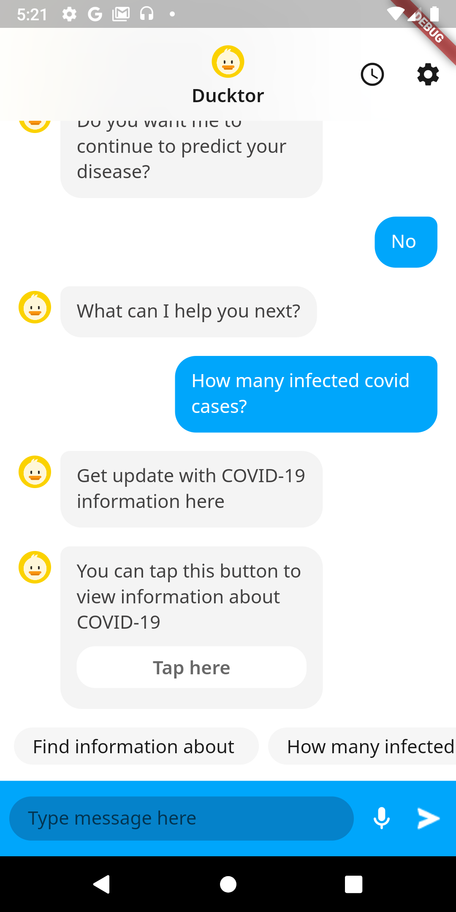

<h1>Ducktor</h3>

[](https://github.com/ltk84/ducktor)
[](https://github.com/ltk84/ducktor)
[](https://github.com/ltk84/ducktor)
[](https://github.com/ltk84/ducktor)

[](https://www.uit.edu.vn/)
[](#team)

<br>

<p align="center">
 </a>
</p>

<p align="center">
<i>This is a school project</i>
</p>

---

## 📝 Table of Contents

- [Introduction](#introduction)
- [Getting Started](#getting-started)
  - [Prerequisites](#prerequisites)
  - [Installation](#installation)
- [UX/UI](#ux/ui)
- [Features](#features)
- [Tech Stacks](#tech-stacks)
- [Team](#team)
- [Future Development](#future-development)
- [License](#license)

## Introduction

This is a healthcare chatbot with the application of machine learning, natural language processing, and entity recognition. In addition, we also handle real-time communication between client and server with Socket.IO.

## Getting Started

### Prerequisites

Android 11.0 or higher.

### Installation

Download the .apk file [here](https://github.com/ltk84/ducktor/releases/latest/download/ducktor.apk) and install it on your Android device.

## UX/UI

</a>
</a>
</a>
</a>
</a>
</a>
</a>
</a>
</a>
</a>
</a>
</a>
</a>
</a>
</a>
</a>
</a>
</a>
</a>

## Features

### Greeting users

Receive greetings from users and perform greeting responses.

### Diagnosing the disease

Recognize the intent requested from the user and diagnoses the underlying disease based on the symptom (from the information provided by the user).

### Providing disease information

Recognize the intent requested from the user and provide basic information about the disease that the user wants to know.

### Provide information on epidemics

Recognize the intent requested from the user and provide vaccination information, disease situation to the user.

### Store chat messages

Store chat history between users with Chatbot.

### Message Suggestions

Message Suggestions for users to easily ask questions and respond to Chatbots.

### Find nearby healthcare facility address

Recognize the requested intent from the user and search for the closest healthcare facility address to the user.

### Sending Messages Through Voice

Allow users to send messages to Chatbot through live recording.

### Reply to Messages with Voice

Allow the Chatbot to read messages sent to users with a customizable voice.

### Voice Settings

Allow to customize Chatbot's voice speed, tone, and volume.

### Theme settings

Allow users to change the interface theme of the application.

### Reminder Notifications

Recognize the intent requested from the user and set up reminders for the user.

## Tech Stacks

- **Client:**
  - [Dart]().
  - [Flutter]().
- **Server:** [Python](https://github.com/TungTLT/ducktor-nlp-service/).
- **Library:** [Socket IO]().

## Team

Ducktor is developed by:

- Trần Lê Thanh Tùng _(TungTLT)_: 19522496@gm.uit.edu.vn
- Trương Kim Lâm _(ltk84)_: 19521743@gm.uit.edu.vn

<br/>

<h4 align="center">
<a href="https://github.com/ltk84/ducktor/graphs/contributors">

</a>

_Made with [contrib.rocks](https://contrib.rocks)._ </h4>

<br/>

## Future Development

It is essential to improve the machine learning models used in this application. We may increase the quality and quantity of the model training dataset through surveys of real data so that speech recognition and disease diagnosis can be performed more accurately. We can also extend diagnostic information such as symptom-based morbidity. In addition, another improvement that can be made is to combine the search for nearby healthcare facilities into the diagnosis to suggest to the user where to check and treat the diseases.

One of the other developments that can easily be done is to expand the response capabilities and content of the Chatbot. It is possible to identify more types of sentences and user purposes, from which there are more interesting and friendly responses. We can expand the interaction between the user and the Chatbot when performing the search for information about health, and disease. At this point, users can ask more specific questions so that the Chatbot can identify and search for relevant information.

<br/>

## License

```
MIT License

Copyright (c) 2022 IT's Zoo Team

Permission is hereby granted, free of charge, to any person obtaining a copy of this software and associated documentation files (the "Software"), to deal in the Software without restriction, including without limitation the rights to use, copy, modify, merge, publish, distribute, sublicense, and/or sell copies of the Software, and to permit persons to whom the Software is furnished to do so, subject to the following conditions:

The above copyright notice and this permission notice shall be included in all copies or substantial portions of the Software.

THE SOFTWARE IS PROVIDED "AS IS", WITHOUT WARRANTY OF ANY KIND, EXPRESS OR IMPLIED, INCLUDING BUT NOT LIMITED TO THE WARRANTIES OF MERCHANTABILITY, FITNESS FOR A PARTICULAR PURPOSE AND NONINFRINGEMENT. IN NO EVENT SHALL THE AUTHORS OR COPYRIGHT HOLDERS BE LIABLE FOR ANY CLAIM, DAMAGES OR OTHER LIABILITY, WHETHER IN AN ACTION OF CONTRACT, TORT OR OTHERWISE, ARISING FROM, OUT OF OR IN CONNECTION WITH THE SOFTWARE OR THE USE OR OTHER DEALINGS IN THE SOFTWARE.
```
